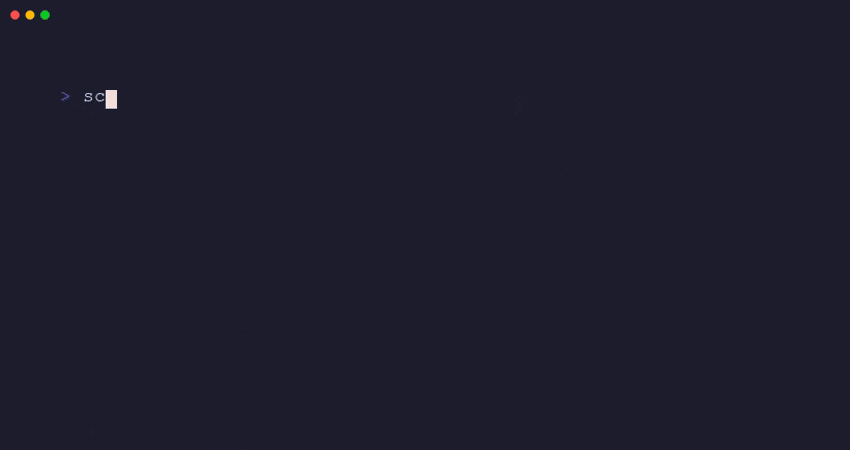

[](https://www.npmjs.com/package/screenie-tool)
[](https://www.npmjs.com/package/screenie-tool)
[](https://github.com/vmihalis/responsiveness-mcp/blob/master/LICENSE)
[](https://nodejs.org/)

# screenie

Capture responsive design screenshots across 57 device viewports with one command.

<p align="center">
  
</p>

## Quick Start

```bash
npx screenie-tool https://your-site.com
```

Screenshots are saved to `./screenshots/` and an HTML report opens automatically.

## Why screenie?

Manually checking your site on dozens of devices is tedious. screenie captures screenshots across phones, tablets, and desktops in seconds, generating a visual report you can scan at a glance.

Instead of:
- Manually resizing your browser window
- Using browser DevTools to test each device
- Missing edge cases on specific screen sizes
- Spending hours on visual QA

With screenie:
- One command captures all 57 device viewports
- Visual HTML report shows all screenshots in a grid
- Filter by device type (phones, tablets, desktops)
- Complete in seconds with parallel capture

## Features

- **57 Device Viewports** - Phones, tablets, and desktops from iPhone to 4K displays
- **HTML Report** - Visual grid of all captures, opens automatically
- **Device Presets** - `--phones-only`, `--tablets-only`, `--desktops-only`
- **Parallel Capture** - Configurable concurrency for fast captures
- **Zero Config** - Works out of the box, no setup required

## Installation

### Using npx (recommended)

No installation needed. Just run:

```bash
npx screenie-tool https://your-site.com
```

This downloads and runs screenie in one step.

### Global Install

For frequent use, install globally:

```bash
npm install -g screenie-tool
```

Then run anywhere:

```bash
screenie https://your-site.com
```

### Requirements

- Node.js 20 or higher
- Chromium is installed automatically on first run via Playwright

## Usage

### Basic capture

Capture all 57 device viewports:

```bash
screenie https://example.com
```

### Capture specific device types

Focus on mobile:

```bash
screenie https://example.com --phones-only
```

Focus on tablets:

```bash
screenie https://example.com --tablets-only
```

Focus on desktops:

```bash
screenie https://example.com --desktops-only
```

### Multiple pages

Capture several pages in one run:

```bash
screenie https://example.com --pages / /about /pricing /contact
```

### Custom output directory

Save screenshots to a specific location:

```bash
screenie https://example.com -o ./my-screenshots
```

### Wait for dynamic content

If your page has animations or lazy-loaded content:

```bash
screenie https://example.com --wait 2000
```

### Control concurrency

Adjust parallel captures (default is auto-detected):

```bash
screenie https://example.com --concurrency 5
```

### Skip opening report

Generate screenshots without opening the browser:

```bash
screenie https://example.com --no-open
```

## Options

| Option | Description | Default |
|--------|-------------|---------|
| `--phones-only` | Only capture phone devices (24 devices) | all |
| `--tablets-only` | Only capture tablet devices (13 devices) | all |
| `--desktops-only` | Only capture desktop devices (20 devices) | all |
| `-c, --concurrency <n>` | Parallel captures (1-50) | auto |
| `-w, --wait <ms>` | Wait after page load | 0 |
| `-o, --output <dir>` | Output directory | ./screenshots |
| `--no-open` | Don't open report in browser | - |
| `--pages <paths...>` | Multiple page paths to capture | - |

## Device Coverage

screenie captures screenshots across 57 real-world device viewports:

### Phones (24 devices)

- **Apple:** iPhone 16 Pro Max, iPhone 16 Pro, iPhone 16 Plus, iPhone 16, iPhone 15 Pro Max, iPhone 15 Pro, iPhone 15 Plus, iPhone 15, iPhone 14 Pro Max, iPhone 14 Pro, iPhone 14 Plus, iPhone 14, iPhone SE
- **Samsung:** Galaxy S24 Ultra, Galaxy S24+, Galaxy S24, Galaxy S23 Ultra, Galaxy Z Fold 5, Galaxy Z Flip 5
- **Google:** Pixel 8 Pro, Pixel 8, Pixel 7 Pro, Pixel 7
- **Other:** OnePlus, Xiaomi, Huawei, Oppo flagships

### Tablets (13 devices)

- **Apple:** iPad Pro 12.9", iPad Pro 11", iPad Air, iPad Mini
- **Samsung:** Galaxy Tab S9 Ultra, Galaxy Tab S9+, Galaxy Tab S9, Galaxy Tab S8 series

### Desktops (20 viewports)

- **Standard:** 1366x768 (HD), 1920x1080 (Full HD), 2560x1440 (QHD), 3840x2160 (4K)
- **MacBooks:** MacBook Air 13", MacBook Pro 14", MacBook Pro 16"
- **Ultrawide:** 2560x1080, 3440x1440 monitors

## Output

Screenshots are organized by device type:

```
screenshots/
  phones/
    iPhone-16-Pro-Max.png
    Galaxy-S24-Ultra.png
    ...
  tablets/
    iPad-Pro-12.9.png
    Galaxy-Tab-S9.png
    ...
  desktops/
    4K-3840x2160.png
    MacBook-Pro-16.png
    ...
  report.html
```

The HTML report provides a visual grid of all captures for quick scanning.

## Contributing

Contributions welcome! Please open an issue to discuss changes before submitting PRs.

## License

MIT
